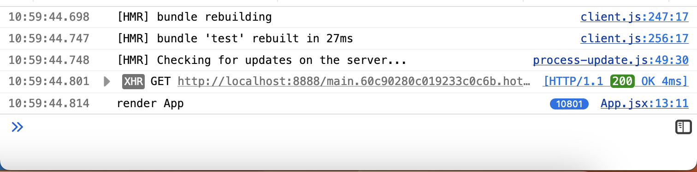

## Steps to reproduce 
1. `git clone git@github.com:plesiecki/preact-hmr-middlewares-repro.git && cd preact-hmr-middlewares-repro && npm ci && npm start`
2. open http://localhost:8080 (`open -a "Google Chrome" http://localhost:8080`) and then open the devtools console
3. edit `src/Test.jsx` and save — **WARNING!** it may hang the browser's tab
4. now you can observe how the `App` component is re-rendering in the inifinite loop — 